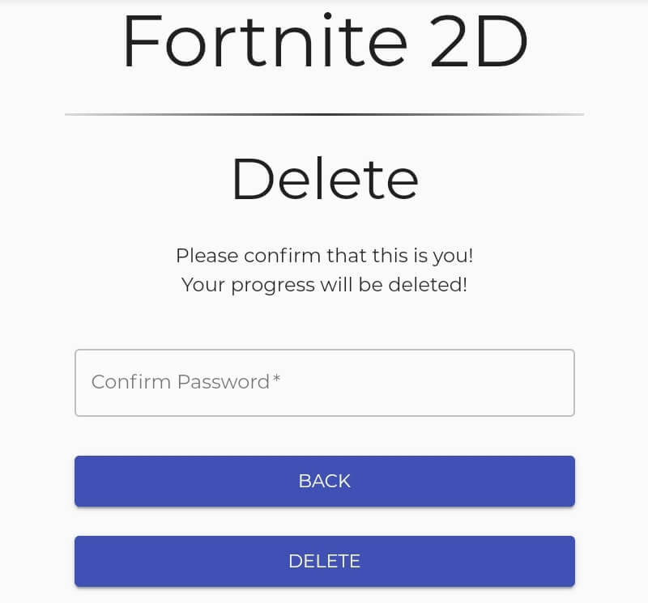

# fortnite-2d-mmmog

A project done in pairs where we had to create a 2D version of Fortnite. This game is a MMMOG (Mobile Massively Multiplayer Online Game).

## Contents

* [Built With](#built-with)
* [Features](#features)
* [Desktop Interfaces](#desktop-interfaces)
* [Mobile Interfaces](#mobile-interfaces)

## Built With

* AJAX
* JQuery
* JSON
* Javascript
* Mobile API
* Node Rest API
* React
* Sqlite3
* Web Sockets

## Features

In addition to the features listed at [Fortnite2D](https://github.com/jaskarnmankoo/fortnite-2d/blob/master/README.md)

### Touch-Screen Controls
* Movement
* Fire Weapon / Build Block
* Switch Inventory
* Swap Weapons

### Server
* Acts as a lobby, with multiple game rooms for players to join
* Each game room has its own players, items, and stage
* Two of the same player cannot join the same room at the same time
* When players join, they are randomly put into a room

## Desktop Interfaces

* [Login](#login)
* [Registration](#registration)
* [Update Profile](#update-profile)
* [Delete Account](#delete-account)
* [Main](#main)
* [Gameplay](#gameplay)

### Login

### Registration

### Update Profile

### Delete Account

### Main

### Gameplay
**Please note actual gameplay is not as slow as below since below is a GIF of gameplay not a video!**

## Mobile Interfaces
* [Login](#login-1)
* [Registration](#registration-1)
* [Update Profile](#update-profile-1)
* [Delete Account](#delete-account-1)
* [Main](#main-1)
* [Gameplay](#gameplay-1)

### Login

### Registration

### Update Profile

### Delete Account

### Main

### Gameplay
**Please note actual gameplay is not as slow as below since below is a GIF of gameplay not a video!**

